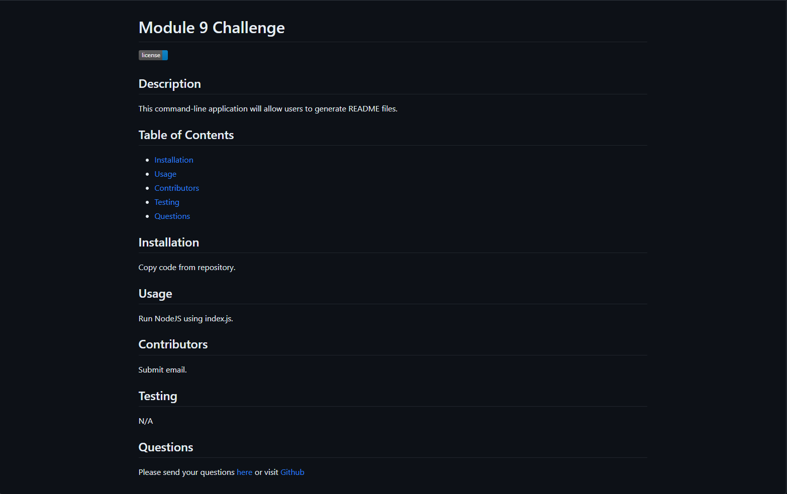

# Professional README Generator

## Description
This README generator was developed using NodeJS, JSON, and inquirer.
## Table of Contents
* [Usage](#usage)
* [Contact-Me](#contact)
* [Contributors](#contributors)
* [Testing](#testing)
* [Demo](#demo)

* [License](#license)

## Usage
The user will be able to generate a README.md file by running NodeJS in the terminal with index.js.

The following image shows the command-line application's appearance and functionality:

## Contact
* Name - Ricardo Scuotto
* Email - ucfscuotto@gmail.com
* Github - [Ricky-Sama](https://github.com/Ricky-Sama/)
## Contributors
N/A
## Testing
N/A

## Demo
<a href="https://drive.google.com/file/d/1mtIn_OpXQizsn5ZZrZIhvMgZ4voTaQo5/view">README Demonstration</a>
## License

        Licensed under the MIT license.